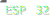
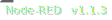

# Proyecto Final Desarrollo de Aplicaciones 3

<BR>

Autor: Lionel Gutiérrez - 2020


[](#)
[](#)
[](#)
[](#)
[](#)
[](#)
[](#)
[](#)

# Introducción
Este proyecto es el trabajo final con el cual se concluye la materia de Desarrollo de aplicaciones 3, de la carrera de Especialización en Internet de las Cosas(CEIot), dictada por la FIUBA.
<BR>
El objetivo es desarrollar una aplicación que integre distintos componentes para el almacenamiento, procesamiento y visualización de datos enviados por al menos dos  dispositivos remotos (IoT). Debe incluirse también alguna configuración remota básica o comando a distancia. Los componentes mínimos del sistema final serán:

1- Servidor MQTT<BR>
2- Aplicación on-line para el almacenamiento de los datos<BR>
3- Aplicación Web<BR>

La aplicación Web deberá permitir visualizar los dispositivos disponibles, realizar el ABM de dispositivos (Altas, borrados y modificaciones). Además, se debe visualizar los datos de humedad y temperatura registrados por cada uno de los dispositivos en un gráfico y se debe poder enviar comandos a los dispositivos, en principio para poder apagar y prender un led.

# Características técnicas
El sistema se implementa con un conjunto de componentes y dispositivos

1- 2 ESP32, que están conectados a sensores de temperatura y humedad DHT11 y DHT22.<BR>
2- Un servidor mosquitto Mqtt, el cual recibe las lecturas de los ESP32, con un tópico especifico asociado. Al mismo tiempo los ESP32 se suscriben a otro tópico para recibir comandos para prender o apagar un led.<BR>
3- Node-RED, que mediante un flujo, lee los tópicos del servidor mqtt y los guarda en una base de datos MySQL.<BR>
4- Aplicación Web.<BR>
   La misma está formada por un back-end y un front-end.<BR>
   La misma está desarrollada con el framework de PHP Laravel. Para el front-end se utilizan componentes Vue y google-charts para mostrar los gráficos de las mediciones y otro componente Vue para poder comunicarse con el servidor mqtt y enviar comandos a los ESP32.<BR>

## Detalles de Aplicación Web
La aplicación web está formada por un conjunto de pantallas y componentes.

1- La visualización de los dispositivos se implementa como una aplicación MVC, para la cual se tiene un modelo de dispositivos y un controlador para la gestión de dispositivos. Luego mediante un conjunto de vistas con formularios, se brinda opciones para visualizar los dispositivos, agregar nuevos, editar los datos de los mismos y borrar dispositivos que queden obsoletos. Del mismo modo, desde la visualización de los dispositivos se puede acceder a las mediciones de los mismos y a la pantalla para enviar comandos.<BR>
2- La visualización de las mediciones de los dispositivos se implementa mediante una vista que tiene un componente Vue que renderiza un google-chart con la información de las mediciones del dispositivo. Además, se cuenta con un calendario, para poder visualizar los datos por día y tener una visión más clara de la información. Los datos de las mediciones se acceden desde el componente a través de una API que expone el back-end.<BR>
3 - Los comandos se implementan como una vista que tiene los datos del dispositivo y un componente Vue que se comunica con el servidor MQTT y publica mensajes para los dispositivos, para permitir prender o apagar un led en los mismos. Los dispositivos se suscriben a tópicos específicos y cuando el usuario envía el comando a través del componente, se genera un mensaje al servidor mqtt, este reenvía el mensaje al dispositivo y en este se genera la actuación.<BR>

## Flujo de información de mediciones
En la siguiente figura se muestra la interacción de los componentes para que la información de las mediciones y dispositivos queden disponibles para el usuario final.<BR><BR>


## Flujo de información de comandos
En la siguiente figura se muestra la interacción de los componentes para que la información de los comandos llegue desde el usuario final a los dispositivos.<BR><BR>


# Pantallas de la aplicación

## Pantalla Principal


<BR>
En la pantalla principal se cuenta con los accesos a las funcionalidades del sistema, esto, el acceso a los datos y ABM de dispositivos, el acceso a la pantalla de mediciones y el acceso a la pantalla de envío de comandos. A su vez, el sistema cuenta con una barra de navegación superior, donde se cuenta con acceso rápidos a estas mismas pantallas
<BR>
<BR>

## Pantalla de Dispositivos


<BR>
En esta pantalla se puede visualizar los datos de los dispositivos dados de alta en el sistema, junto a accesos a las opciones de edición de datos, borrado, mediciones y comandos.<BR>
Las acciones posible se realizan mediante estos botones:<BR>
 : Permite acceder a la pantalla de agregado de dispositivos.<BR>
 : Permite acceder a la pantalla de modificación del dispositivo.<BR>
 : Permite eliminar el dispositivo. El sistema solicita confirmación antes de realizarlo.<BR>
 : Permite acceder a las mediciones del dispositivo.<BR>
 : Permite acceder a los comandos del dispositivo.<BR>

Los dispositivos se muestran paginados, de a 3 dispositivos por página.
<BR>

### Pantalla Alta de Dispositivos


En esta pantalla se puede dar de alta nuevos dispositivos.
Los campos disponibles son:<BR>
- **Nombre:** El nombre del dispositivo. Este campo es obligatorio.<BR>
- **Descripción:** Descripción del dispositivo. Este campo es obligatorio.<BR>
- **Tipo:** Tipo de dispositivo. Se utiliza para configurar el tópico que envía el dispositivo, para permitir las lecturas y mediciones.<BR>
- **Ubicación:** Ubicación del dispositivo. Este campo es obligatorio.<BR>
<BR>
Una vez detallados los datos se hace click en el botón Guardar. El sistema da de alta el dispositivo y vuelve a la pantalla de dispositivos. También se puede volver al listado sin realizar el alta con el botón Volver.

### Pantalla Edición de Dispositivos


En esta pantalla se puede modificar los datos de los dispositivos.
Los campos disponibles son:<BR>
- **Nombre:** El nombre del dispositivo. Este campo es obligatorio.<BR>
- **Descripción:** Descripción del dispositivo. Este campo es obligatorio.<BR>
- **Tipo:** Tipo de dispositivo. Se utiliza para configurar el tópico que envía el dispositivo, para permitir las lecturas y mediciones.<BR>
- **Ubicación:** Ubicación del dispositivo. Este campo es obligatorio.<BR>
<BR>
Una vez detallados los datos se hace click en el botón Actualizar. El sistema modifica los datos del dispositivo y vuelve a la pantalla de dispositivos. También se puede volver al listado sin realizar modificaciones con el botón Volver.

### Borrado de Dispositivos

Para borrar un dispositivo se debe utilizar el botón .<BR>
El sistema pide confirmación antes de la eliminación.<BR>


## Pantalla de Mediciones


<BR>
En esta pantalla se puede visualizar los dispositivos que tienen mediciones registradas y acceder al gráfico de las mismas.<BR>
Para acceder a las mediciones se debe hacer click en el botón <BR>

## Pantalla de Gráfico de mediciones


<BR>
En esta pantalla se puede visualizar las mediciones de un dispositivos por día.<BR>
Por defecto el sistema muestra las mediciones del día actual, pero se cuenta con un calendario para seleccionar la fecha y visualizar los datos de días anteriores. Además se pueden refrescar los datos del día utilizando el botón "Refrescar"<BR>
Los datos se muestran como un gráfico de 2 escalas, uno para la humedad y otro para la temperatura.<BR>
<BR>
**Si el usauario está visualizando las mediciones del día actual, el sistema automáticamente hace un refresh de la pantalla a los 5 minutos, para recargar y permitir ver los datos actualizados.**
<BR>
<BR>
Si el sistema no tiene datos para el día seleccionado se muestra el gráfico sin datos como en la siguiente figura:<BR>


## Pantalla de Comandos


<BR>
En esta pantalla se puede visualizar los dispositivos disponibles en sistema, para enviarles comandos.<BR>
Para enviar comandos a un dispositivo se debe hacer click en el botón <BR>

## Pantalla de envío de Comandos


<BR>
En esta pantalla se puede visualizar los datos del dispositivo y enviar comandos para prender y apagar un led en el mismo.<BR>
Para enviar el comando basta con hacer click en los botones de  o <BR>
Al hacer click el sistema publica un mensaje en el servidor mqtt. El dispositivo está suscripto al tópico enviado, recibe el comando y actúa en consecuencia.<BR>
<BR>

### Ejemplo de envío de Comandos
A continuación se muestra como el envío de comando prende y apaga las luces de los ESP32.
<BR>
Primero se envía el comando de "Prender" desde la aplicación.<BR><BR>
<BR><BR>
Y vemos que el ESP prende su led. <BR><BR>
<BR><BR>
Ahora se envía el comando de "Apagar" desde la aplicación.<BR><BR>
<BR><BR>
Y vemos que el ESP apaga su led. <BR><BR>
<BR><BR>

# Correr la aplicación
Para ejecutar el sistema se deben seguir estos pasos:<BR>
1- prender los dispositivos ESP32,<BR>
2- levantar el servidor mosquitto,<BR>
3- levantar el Node-RED, importando los flujos (archivo "codigoNodeRed" ) que se encuentra dentro de la carpeta App-online-NodeRed,<BR>
4- levantar el sistema web, para lo cual se utiliza el código de la carpeta "proyectofinal". Una vez ubicados dentro de la carpeta se debe ejecutar el comando:<BR>

```sh
php artisan serve
```

Esto levanta la aplicación en  ​[http://localhost:8000/](http://localhost:8000), mostrando la pantalla principal.


# Estructura de Directorios del repositorio

El repositorio está organizado en un conjunto de carpetas y archivos

    .
    ├──App-online-NodeRed            # Dentro de esta carpeta se cuenta con los flujos de Node-Red para implementar esta parte de la solución y un archivo de
    ├                                  información con detalle de la implementación de esta funcionalidad.
    ├──codigo-auxiliar               # Contiene 2 carpetas. Una con información del ESP32 (codigo-esp32) que contiene tanto el código a implementar en el ESP32
    ├                                  como el conexionado del circuito. Y otra carpeta (mqtt-formatos) con información de los formatos utilizados por 
    ├                                  los dispositivos para la suscripción y publicación de sus mensajes.
    ├──proyectofinal                 # aplicación Web en framework Laravel y PHP. Dentro de la misma están todas las carpetas de configuración, dependencias, rutas, 
    ├                                  vistas, controladores, modelos y componentes vue necesarios para desplegar tanto el front-end como el back-end de la misma.
    ├──imagenes-doc                  # imágenes auxiliares para la documentación.
    └──readme.md                     # Documentación de la aplicación.


# Flujos de gitflow utilizados
Para la gestión de versiones del proyecto se utilizó GitFLow.<BR>
A continuación se describen los features utilizados:<BR>
- feature crearproyecto: creación inicial del proyecto.
- feature codigoESP32: creación de carpeta auxiliar con codigo a utilizar en el ESP32 y detalles de documentación del mismo.
- feature app-almacenamiento-datos: creación de la carpeta donde se almacenan los flows utilizados en NodeRed para guardar los datos en la base de datos.
- feature listado-dispositivos: creación de la parte del modelo que gestiona los dispositivos y el ABM de los mismos en el aplicativo Web.
- feature mediciones: generación de la API para mostrar las mediciones de los sensores y las páginas para ver los gráficos de los sensores.
- features actuadores: generación de la pantalla y componente para poder prender los leds desde el Aplicativo Web.
- features pantalla-principal: armado de la pagina principal del sistema.
- features documentacion: armado de la documentación del proyecto.
- features mejoras: mejoras en el código del proyecto y agregado de recarga automática en gráfico de mediciones, si se está visualizando el día actual.


